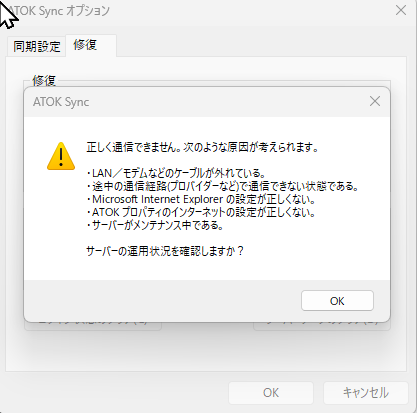
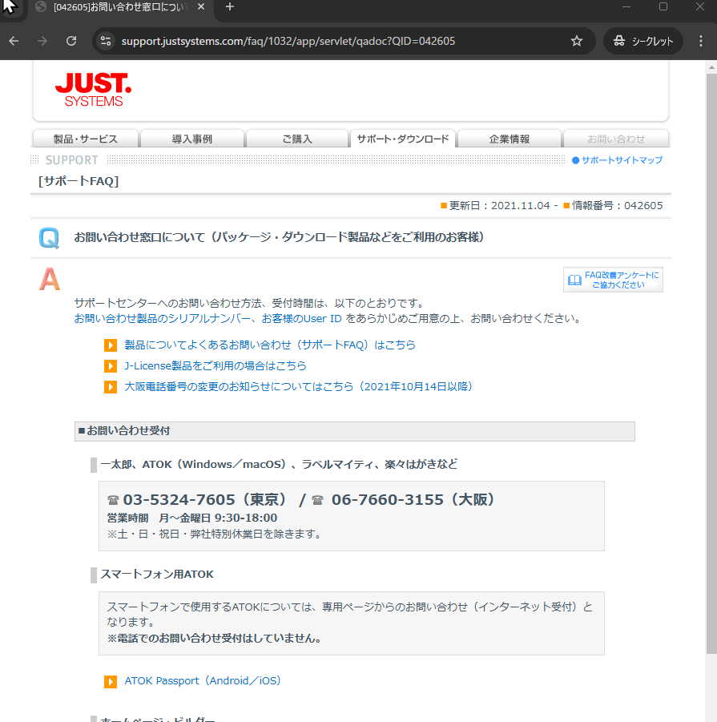

## 始めに

+ Windows 11 で ATOK Sync が「正しく通信できません。次のような原因が考えられます。」とエラーが出て利用できなくなった場合の対処法メモです。

## 確認したバージョン

```
エディション	Windows 11 Home
バージョン	24H2
OS ビルド	26100.2894
エクスペリエンス	Windows 機能エクスペリエンス パック 1000.26100.36.0
```

## 症状

+ 画像のようなエラーとなる。\


## 改善手順

1. ATOK Syncをアンインストール
   1. これは設定→アプリ→インストールされているアプリ　に ATOK Sync として存在しているので、こちらをアンインストール。
2. `%USERPROFILE%\AppData\Roaming\Justsystem`にある`Atoksync`フォルダを削除
   1. とはいえ、何かあったら怖いので、私の場合はリネームで対応しました。
3. ATOK Sync を再インストール
   1. JUSTオンラインアップデート経由が簡単でした。
4. ATOK Sync の初期設定を行い、初回の同期をする。

## まとめ

今回、自分にこういう問題が発生し、最初はサポートに問い合わせようと思ったのですが、[問い合わせ窓口が電話のみだった](http://support.justsystems.com/faq/1032/app/servlet/qadoc?QID=042605)ため、めんどくさくなり…\


DNSの返答とか、通信経路など通信周りは問題が無い、別PCで動作する。などの確認を経てこの解決策にたどり着きました。

ジャストシステムさん、PC版ATOKにもメールや問い合わせフォームでのお問い合わせ窓口などを作ってほしいな～～～（おねがい）
※ スマホ版は問い合わせフォームがのみっぽい。こちらに書いて良かったのだろうか…
